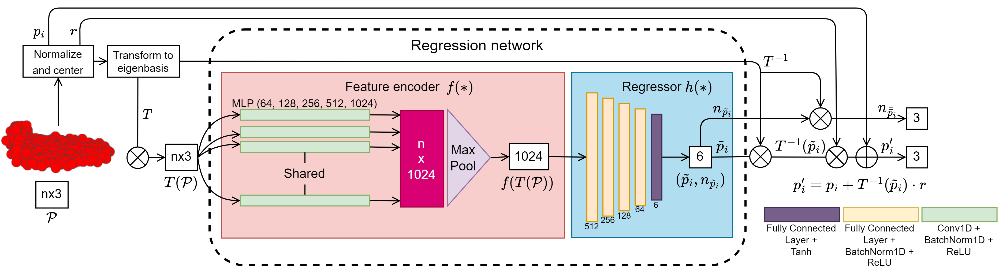

# Contrastive Learning for Joint Normal Estimation and Point Cloud Filtering

```This is the official implementation of the paper titled "Contrastive Learning for Joint Normal Estimation and Point Cloud Filtering", accepted to IEEE Transactions on Visualization and Computer Graphics.```

# Install software requirements
Please run the following pip install command:
```
pip install -r requirements.txt -f https://download.pytorch.org/whl/torch_stable.html
```
This command has been added to the bash run script in order to set up your environment on the fly. 

We have tested our networks with the following setup:
```
Python 3.7
Ubuntu 20.04.3
CUDA 11.0
PyTorch 1.7.0
```

# Download code + dataset + pre-trained models

Currently, we have released our inference script along with our trained regression network. **UPDATE: we have also released the training scripts but are in the process of cleaning up the instructions on this README file.**

The training set for our regression network is the same as of [Pointfilter](https://github.com/dongbo-BUAA-VR/Pointfilter). For all train, validation and test data, as well as pre-trained checkpoints, please visit the link [here](https://drive.google.com/file/d/1ZukurNYzVv85psQ7AI7Vo0Sqdh_XIWtA/view?usp=drive_link).

Once downloaded, unzip and place the Train, Test and Validation folders within the ```Dataset``` folder such that the paths for the Train, Test and Validation sets are ```/Dataset/Train```, ```Dataset/Test```, ```Dataset/Validation```.

# How to run

## Preliminaries before running inference
The inference script accepts only point clouds in the '.ply' format. Please convert your test point clouds to this format.

**Please make sure the test set point clouds have both point positions and point normals.**
- Our method estimates **unoriented** normals. We use PCA normals as references to flip our estimated unoriented normals to a more consistent direction.
- Thereafter, our estimated normals are used in the LRMA post-processing algorithm to update point positions.
- We use the following neighborhood sizes, for the corresponding noise levels, for the PCA normals:
	* sigma = 0.6%: **60**
	* sigma = 0.8%: **150**
	* sigma = 1.1%: **200**
	* sigma = 1.5%: **200**
	* sigma = 2.0%: **200**

## Dataset
Please place the Test directory within the ```Dataset``` directory such that the paths for the Test set is ```Dataset/Test```.

The names of input files should be listed within ```test.txt``` (or whichever name specified in --shapes_list_file) and saved in the Test directory.

## Run inference only
To run inference, please run the following bash command within the root directory:
```
./Run_Inference_Only.sh
```
Here, the pre-trained regressor available at ```./RegressorPreTrained``` will be used. Also, you may use the following command:
```
python ./Inference.py --checkpoint_path="./RegressorPreTrained/chkpt_cbs_512_ep30_a0.90_b0.01_d0.30_g12.pth.tar" --shapes_list_file="test.txt" --eval_iter_nums=4
```

## Important points
Please note the following:
- Our method removes extreme outliers from the filtered point cloud. This is especially important for high noise point clouds where multiple such outliers may exist. 
- Therefore, the corresponding point, in the ground truth point cloud should also be removed. This corrected ground truth should be used when calculating Angular Error or Point to Surface values for each point.
- To save corrected GTs, set **save_corrected_gt_points** to **True** in line 75 of inference.py and specify the root directory **gt_root** for the original ground truth point clouds in line 68.

## Train either the feature encoder or regressor
If you wish to only train the feature encoder using contrastive learning, or the regressor using the normal and position based loss, you may run ```./Run_Feature_Encoder_Training_Only.sh``` for feature encoder training or you may train the regressor using the following command: ```./Run_Regressor_Training_Only.sh```.

For the last scenario, the pre-trained feature encoder has to be downloaded and saved to the ```./FeatureEncoderPreTrained``` folder before you may train the regressor. Please download the pre-trained checkpoints from the above [link](https://drive.google.com/file/d/1ZukurNYzVv85psQ7AI7Vo0Sqdh_XIWtA/view?usp=drive_link) and pick out the feature encoder checkpoint.

## Train the feature encoder, regressor and perform inference using newly trained models
You may either run the feature encoding training, regressor training and inference all together. In this scenario, the feature encoder and the regressor have to be trained before inference can be done. The following bash script ```Run_All.sh``` accomplishes that and can be run from the root directory:
```
./Run_All.sh
```
The trained feature encoder and regressor will be saved into ```./FeatureEncoderTrained``` and ```./RegressorTrained```, respectively.

# Acknowledgement and citation
Our code is partially based on ``Pointfilter: Point Cloud Filtering via Encoder-Decoder Modeling`` by Zhang et al. Kudos to them for their excellent implementation and resources. Please check their GitHub repo [here](https://github.com/dongbo-BUAA-VR/Pointfilter).

If you find our paper interesting and our code useful, please cite our paper with the following BibTex citation:
```
@Article{de_Silva_Edirimuni_2023_TVCG,
  author={Edirimuni, Dasith de Silva and Lu, Xuequan and Li, Gang and Robles-Kelly, Antonio},
  journal={IEEE Transactions on Visualization and Computer Graphics}, 
  title={Contrastive Learning for Joint Normal Estimation and Point Cloud Filtering}, 
  year={2023},
  volume={},
  number={},
  pages={1-15},
  doi={10.1109/TVCG.2023.3263866}
}
```